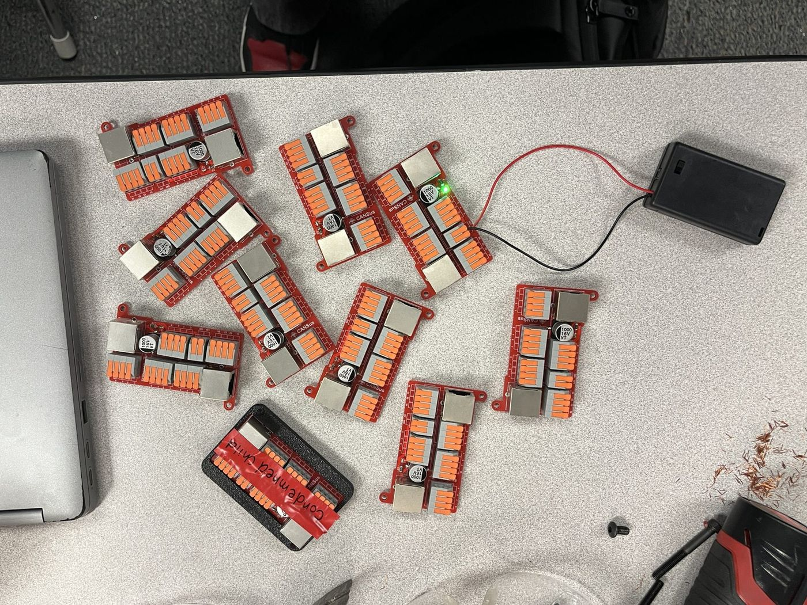
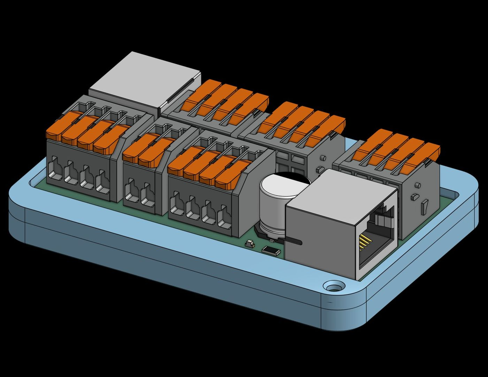
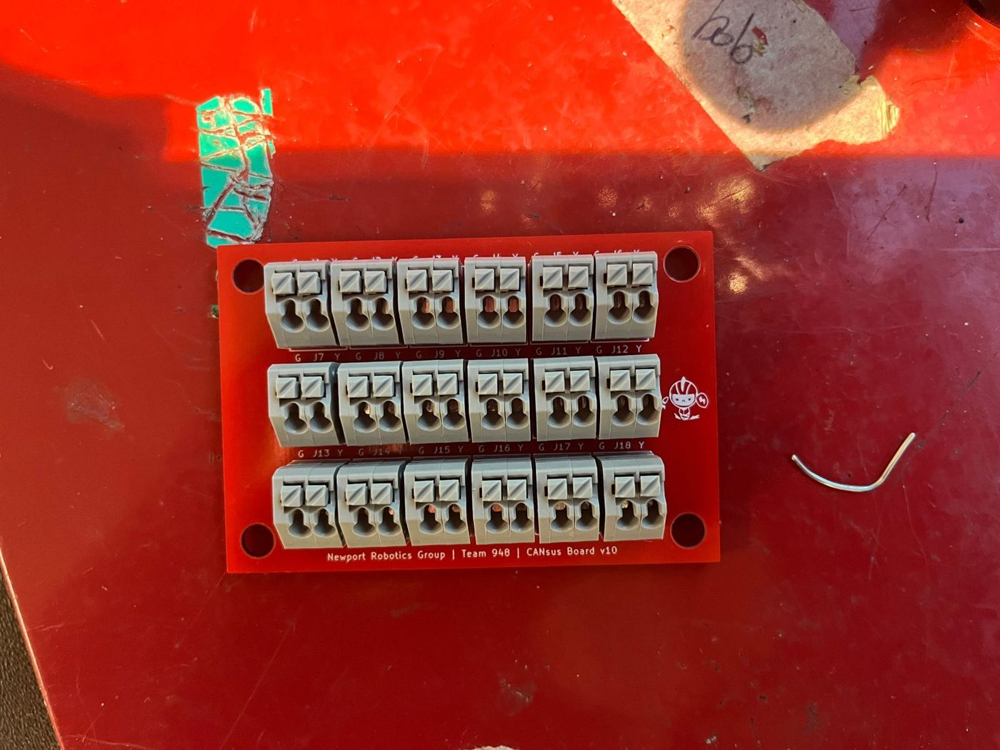

# CANsus

**CANsus** ("CAN sustain") is an iterated CAN, power, and auxiliary-signal distribution PCB developed for **Newport Robotics Group (Team 948)**. The project evolved from a CAN-only terminal board into a compact, serviceable wiring hub with modular connectors, power distribution, status indication, and a documented hardware revision history.



## Project overview

Robot electrical systems accumulate many point-to-point connections that must remain reliable, easy to diagnose, and practical to service under time pressure. CANsus explores a purpose-built distribution board for organizing those connections in a repeatable PCB assembly instead of relying only on loose in-line wiring.

The available KiCad history spans **v10 through v16** and shows several major design iterations: connector-family changes, board-size optimization, addition of power and auxiliary signals, migration of support components to SMD footprints, and simplification of the final interface.

This repository is intended to show not only the final hardware, but also the engineering iteration behind it.

## Engineering highlights

- **Seven documented KiCad revisions (v10-v16)** compared from the supplied design files.
- Progressed from **CAN-only distribution** to a combined **CAN + 12 V/GND + auxiliary-signal** interface.
- Added **dual RJ45 interfaces**, a bulk capacitor, and an LED status circuit beginning in v13.
- Reworked the terminal architecture in v14 from many 2-position blocks to larger **WAGO 2601-series multi-position connectors**.
- Reduced the v14 board envelope from approximately **86 × 53 mm** to **73.25 × 52.94 mm** in v15 while removing one redundant auxiliary connector — about a **14.8% reduction in width**.
- v16 simplifies the auxiliary interface from four signal nets to **two signal nets**, repurposing the remaining terminal capacity for 12 V and GND.
- The v16 layout uses **1.5 mm routing for 12 V/GND distribution** and **0.25 mm routing for CAN and auxiliary signals**.
- Physical board photos and a mechanical render document the transition from PCB design to assembled hardware.

> Revision details below are reconstructed directly from differences in the supplied KiCad schematic and PCB files. Where the files do not record the reason for a change, the documentation describes only the observed design change rather than inventing a rationale.

## Latest supplied electrical architecture — v16

The v16 design is a 2-layer, nominal 1.6 mm PCB with an Edge.Cuts envelope of approximately **73.25 × 52.94 mm**.

| Interface | Function |
|---|---|
| J1-J4 | WAGO 2601-1104 CAN distribution blocks; repeated CAN_HI / CAN_LO connections |
| J5 | WAGO 2601-1104 carrying SIGNAL_1, SIGNAL_2, 12 V, and GND |
| J7 | WAGO 2601-1102 carrying 12 V and GND |
| RJ1, RJ2 | 12 V, GND, SIGNAL_1, SIGNAL_2, CAN_HI, and CAN_LO; pins 5/6 are intentionally unconnected in v16 |
| C1 | Bulk capacitance across 12 V and GND |
| D1 + R1 | Power/status LED circuit |
| H1, H2 | #4-40 mounting holes |

The v16 RJ45 mapping visible in the PCB source is:

| Pin | Signal |
|---:|---|
| 1 | 12 V |
| 2 | GND |
| 3 | SIGNAL_1 |
| 4 | SIGNAL_2 |
| 5 | NC |
| 6 | NC |
| 7 | CAN_HI |
| 8 | CAN_LO |

## Design evolution

| Revision | Key change |
|---|---|
| **v10** | CAN-only baseline using 18 WAGO 250-202 two-position terminals and four mounting holes. |
| **v11** | Switched to WAGO 2601-3102 connectors, reduced the terminal count to 12, and narrowed the board. |
| **v12** | Reduced the CAN terminal count again to 10 and substantially compacted the board outline. |
| **v13** | Major functional expansion: added 12 V/GND, SIGNAL_1-SIGNAL_4, two RJ45 connectors, bulk capacitance, and an LED/resistor indicator circuit. |
| **v14** | Major connector/mechanical redesign: moved to 2601-1104/1102 terminal blocks, changed RJ45 footprint family, migrated the LED/resistor support circuitry to SMD footprints, and reduced mounting holes from four to two. |
| **v15** | Removed one duplicated auxiliary terminal block and reduced board width from 86 mm to 73.25 mm. |
| **v16** | Simplified the auxiliary interface to SIGNAL_1/SIGNAL_2; RJ45 pins 5/6 became NC and J5 was repurposed to include 12 V/GND. |

See [REVISION_LOG.md](REVISION_LOG.md) for the source-derived comparison and dimensional details.

## Hardware

### Assembled board


The assembled-board photo shows multiple fabricated CANsus boards, lever terminals, modular connectors, the bulk capacitor, and an illuminated status LED.

### Mechanical / enclosure render



### Earlier board



The earlier photo visibly carries **CANsus Board v10** silkscreen. The photo filenames use a separate “Version 1 / Version 5” media-labeling scheme, so this repository treats the KiCad folder names (v10-v16) as the electrical design revision sequence.

## Repository contents

```text
.
├── LICENSE
├── README.md
├── REVISION_LOG.md
├── bom/
│   └── BOM.csv
├── docs/
│   ├── README.md
│   ├── cansus-board-layout.pdf
│   └── cansus-schematic.pdf
├── hardware/
│   └── kicad/
│       ├── CAN_board.kicad_pcb
│       ├── CAN_board.kicad_pro
│       ├── CAN_board.kicad_sch
│       ├── fp-lib-table
│       ├── sym-lib-table
│       └── README.md
└── photos/
    ├── cansus-v1.jpg
    ├── cansus-v5-assembled.jpg
    └── cansus-v5-render.jpg
```

## Reviewing the project

For a quick technical review:

1. Start with this README for the system architecture and design progression.
2. Read [REVISION_LOG.md](REVISION_LOG.md) for the v10-v16 hardware comparison.
3. Open the [KiCad source](hardware/kicad/) to inspect the schematic and routed PCB.
4. Review the [BOM](bom/BOM.csv) for component references.
5. Use the [PDF exports](docs/) and photos for a fast visual overview.

The browsable `hardware/kicad/` directory is the previously committed v15 source snapshot. The additional v10-v16 KiCad export set was used to reconstruct the revision history in this documentation. The supplied PDF exports also correspond to the four-signal v14/v15-era architecture; see [docs/README.md](docs/README.md).

## Tools and engineering scope represented

**KiCad 8 · schematic capture · PCB layout · connector/footprint selection · mixed through-hole/SMD design · mechanical packaging · hardware iteration · BOM/documentation · prototype assembly**

## Source notes

Some PCB 3D-model references use absolute paths from the original workstation, so a few models may be missing in KiCad's 3D viewer on another computer. The electrical schematic and PCB footprints are still embedded in the KiCad project files.

R1 is labeled simply `R` in the supplied schematic; its resistance value is therefore intentionally left unspecified in the BOM rather than guessed.

## License

Released under the [MIT License](LICENSE).
